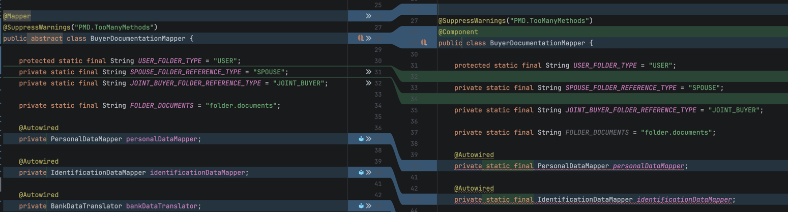
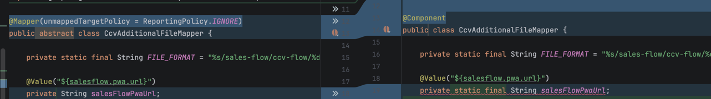
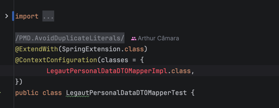
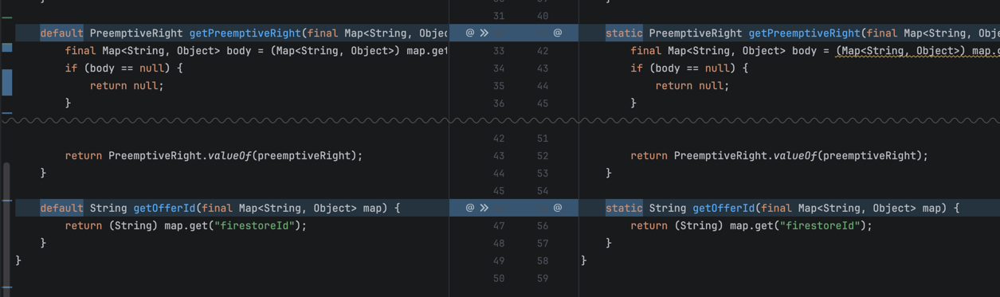
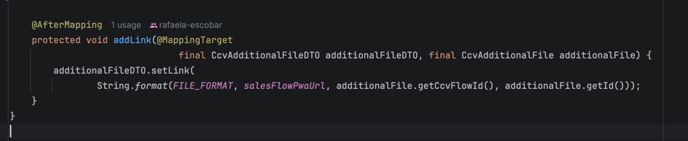

# Fixes

## Implementation

Copy fields as is. Don't do any accessor transformations. It fails spring when I
add final to fields.

Rename implementation classes when they are passed as class parameters into annotations

## Declaration

Default methods and fields copied from interfaces should be explicitly set as public. Non-default should keep their
visibility. They should also not be made static

## Generation

Remove AfterMapping and MappingTarget from the generated method

# Features

Add another recipe that inserts a lombok @Builder decorator into all classes that are target of a mapper
